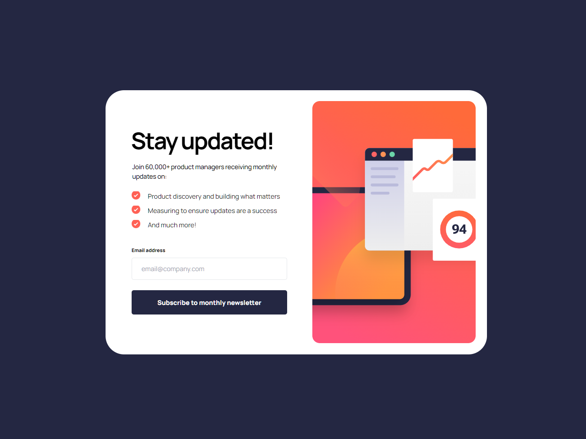

# Newsletter Sign-up Form with Success Message

A responsive newsletter subscription form with email validation and success state management, built with HTML, CSS, and JavaScript.



## 🚀 Features

- **Email validation** using Validator.js library
- **Success state management** with smooth transitions
- **Error state handling** with inline messages
- **Responsive design** for mobile and desktop
- **Accessibility features** including semantic HTML and keyboard navigation
- **Custom cursor** and hover effects
- **Form state persistence** (clears on dismiss)

## 🛠️ Technologies Used

- **HTML5** semantic markup
- **CSS3** with Tailwind CSS framework
- **JavaScript ES6+** with DOM manipulation
- **Validator.js** for email validation
- **Custom CSS utilities** for project-specific styling

## 📱 Responsive Design

- **Mobile-first approach** with progressive enhancement
- **Tailwind CSS** for utility-first styling
- **Flexible layout** adapting to different screen sizes
- **Touch-friendly** form controls

## ✨ User Experience

- **Real-time validation feedback** without page reloads
- **Smooth state transitions** between form and success
- **Clear error messaging** for better accessibility
- **Persistent form state** management
- **Custom cursor** for enhanced interactivity

## 🔧 Implementation Details

### Form Validation
- **Required field validation** for empty email
- **Email format validation** using regex patterns
- **Inline error messages** with proper styling
- **Input event listeners** for immediate feedback

### State Management
- **Form visibility toggle** using CSS classes
- **Success message display** with user email
- **Error state clearing** on user interaction
- **Form reset functionality** after success dismissal

### Accessibility Features
- **Semantic HTML structure** with proper labeling
- **Keyboard navigation support** with logical tab order
- **ARIA attributes** for screen reader compatibility
- **Focus indicators** for interactive elements
- **WCAG 2.1 contrast compliance** (80/20 rule)

## 🎯 Key Learnings

- **Form validation patterns** with Validator.js integration
- **CSS specificity management** and utility class creation
- **State management** in vanilla JavaScript
- **Responsive design implementation** with Tailwind CSS
- **Accessibility best practices** for modern web development
- **Browser compatibility** handling for autocomplete and validation
- **Debugging techniques** for CSS and JavaScript issues

## 🚀 Getting Started

1. **Clone the repository**
   ```bash
   git clone [repository-url]
   cd newsletter-sign-up-with-success-message-main
   ```

2. **Install dependencies**
   ```bash
   npm install  # or use the included assets
   ```

3. **Start development server**
   ```bash
   npx tailwindcss -i ./src/input.css -o ./src/output.css --watch
   ```

4. **Open in browser**
   Navigate to `index.html` and test the form functionality

## 📁 Project Structure

```
newsletter-sign-up-with-success-message-main/
├── assets/
│   ├── images/
│   │   ├── icon-list.svg
│   │   ├── icon-success.svg
│   │   ├── illustration-sign-up-desktop.svg
│   │   └── favicon-32x32.png
│   └── icons/
│       └── cursor.png
├── design/
│   ├── desktop-design.jpg
│   ├── desktop-success.jpg
│   ├── error-states.jpg
│   └── mobile-design.jpg
├── src/
│   ├── input.css
│   └── output.css
├── validator.js-master/
│   └── packages/core/dist/
│       ├── validator.js
│       └── validator.min.js
├── classic.validator.min.js
├── tailwind.config.js
├── index.html
└── README.md
```

## 🎨 Customization

The project uses a custom Tailwind configuration with:
- **Utility classes** for layout (`.col-x-center`, `.row-y-center`, etc.)
- **Custom cursor** implementation
- **Color variables** for consistent theming
- **Responsive breakpoints** for mobile/desktop optimization

## 🔍 Browser Support

- **Modern browsers** (Chrome, Firefox, Safari, Edge)
- **Mobile responsive** with touch support
- **JavaScript ES6+** features
- **CSS3** properties with fallbacks

## 📱 Demo

[Live Demo](https://your-demo-url.com) | [GitHub Repository](https://github.com/yourusername/newsletter-sign-up-with-success-message)

---

**Built with ❤️ for Frontend Mentor Challenge**
